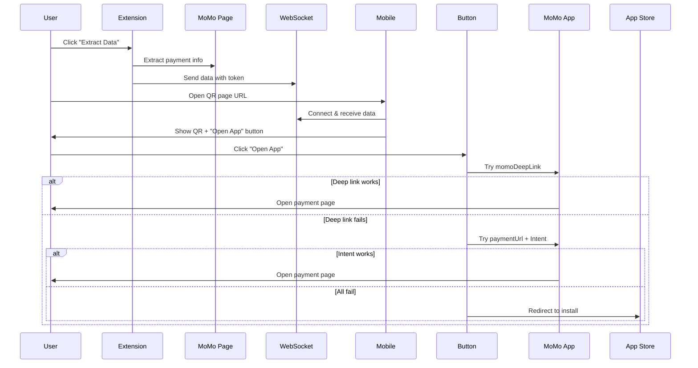

# 📱 Hướng dẫn Deep Link MoMo

## Cách hoạt động của nút "Mở bằng App MoMo"

### 🎯 Chiến lược mở app

Nút "Mở bằng App MoMo" sẽ thử các phương pháp sau theo thứ tự ưu tiên:

#### 1️⃣ **MoMo Deep Link** (Ưu tiên cao nhất)
```
momo://qr/pay?data=...
```
- Nếu trang MoMo có deep link trong HTML
- Mở trực tiếp trang thanh toán trong app

#### 2️⃣ **Payment URL với Intent (Android)**
```
intent://payment.momo.vn/...#Intent;scheme=https;package=com.momo.platform;end
```
- Sử dụng Android Intent để mở URL trong MoMo app
- Fallback sang browser nếu app không cài

#### 3️⃣ **Payment URL trực tiếp (iOS)**
```
https://payment.momo.vn/...
```
- iOS Universal Links - MoMo app sẽ intercept
- Nếu app không cài, mở trong Safari

#### 4️⃣ **Mở MoMo App (Fallback cuối)**
```
momo://app
```
- Chỉ mở app MoMo, không có link cụ thể
- User phải tự tìm giao dịch trong app

---

## 📊 Dữ liệu được truyền

Extension sẽ trích xuất và gửi các thông tin sau:

```javascript
{
  qrCode: "data:image/png;base64,...",        // Hình ảnh QR code
  paymentUrl: "https://payment.momo.vn/...",  // URL trang thanh toán
  momoDeepLink: "momo://qr/pay?data=...",     // Deep link (nếu có)
  merchant: "Tên nhà cung cấp",
  orderId: "ORD123456",
  amount: 100000,
  description: "Mô tả đơn hàng",
  countdown: 600
}
```

---

## 🧪 Cách Test

### Test trên Desktop (Development)
```bash
# 1. Chạy React app
npm start

# 2. Chạy WebSocket server
cd server && npm start

# 3. Mở browser với extension
# 4. Vào trang thanh toán MoMo
# 5. Click extension để extract data
# 6. Mở URL QR page trên mobile
```

### Test trên Mobile

#### Cách 1: Sử dụng ngrok (Khuyến nghị)
```bash
# Install ngrok
brew install ngrok

# Expose React app
ngrok http 3000

# Sẽ nhận được URL: https://abc123.ngrok.io
# Mở URL này trên mobile
```

#### Cách 2: Sử dụng Local IP
```bash
# Lấy IP local
ifconfig | grep "inet " | grep -v 127.0.0.1

# Ví dụ IP: 192.168.1.100
# Mở trên mobile: http://192.168.1.100:3000
```

---

## 🔍 Debug

### Kiểm tra dữ liệu nhận được

Mở Console trong PaymentCard component:

```javascript
// Trong handleOpenApp()
console.log('Payment Data:', data);
console.log('Has momoDeepLink:', !!data.momoDeepLink);
console.log('Has paymentUrl:', !!data.paymentUrl);
console.log('User Agent:', navigator.userAgent);
```

### Test Deep Link trên Mobile

#### Android (ADB)
```bash
# Test intent
adb shell am start -W -a android.intent.action.VIEW \
  -d "intent://payment.momo.vn/gw/...#Intent;scheme=https;package=com.momo.platform;end"

# Kiểm tra MoMo app đã cài chưa
adb shell pm list packages | grep momo
```

#### iOS (Safari)
```javascript
// Paste vào Safari console
window.location.href = 'momo://app';

// Hoặc test universal link
window.location.href = 'https://payment.momo.vn/...';
```

---

## 📝 Cấu trúc MoMo Deep Link

### Format chuẩn (nếu có)
```
momo://qr/pay?data=<base64_encoded_qr_data>
momo://payment?id=<payment_id>
momo://transaction?code=<transaction_code>
```

### Universal Links (iOS)
```
https://m.momo.vn/payment/...
https://payment.momo.vn/...
```

**Lưu ý:** MoMo cần được config để handle các URL này.

---

## 🛠️ Troubleshooting

### Vấn đề 1: Nút không hiện trên mobile
**Nguyên nhân:** CSS media query chưa đúng

**Kiểm tra:**
```css
/* Trong PaymentCard.css */
@media (max-width: 1024px) {
  .open-app-button {
    display: flex; /* Phải là flex, không phải none */
  }
}
```

### Vấn đề 2: Click nút nhưng không mở app
**Nguyên nhân:** 
- App chưa cài đặt
- Deep link không đúng format
- Browser chặn redirect

**Giải pháp:**
1. Kiểm tra console log xem link nào được dùng
2. Test thủ công với ADB/Safari console
3. Kiểm tra timeout fallback (2 giây)

### Vấn đề 3: Mở được app nhưng không vào đúng trang thanh toán
**Nguyên nhân:** 
- `momoDeepLink` không có hoặc sai format
- `paymentUrl` không phải Universal Link của MoMo

**Giải pháp:**
1. Kiểm tra extension có extract được `momoDeepLink` không
2. Xem trang MoMo có chứa deep link trong HTML không
3. Nếu không có, phải dùng `paymentUrl` + Intent

---

## 🔄 Workflow hoàn chỉnh



---

## 📌 Best Practices

1. **Luôn log** để debug
   ```javascript
   console.log('Opening MoMo with:', data.momoDeepLink || data.paymentUrl);
   ```

2. **Kiểm tra document.hidden** để tránh redirect khi đã mở app
   ```javascript
   setTimeout(() => {
     if (document.hidden) return; // App đã mở
     // Fallback to app store
   }, 2000);
   ```

3. **Tăng timeout** nếu thiết bị chậm
   ```javascript
   setTimeout(..., 3000); // 3 giây thay vì 2
   ```

4. **Test trên nhiều thiết bị**
   - Android versions: 10, 11, 12, 13+
   - iOS versions: 14, 15, 16, 17+
   - Các browsers: Chrome, Safari, Firefox

---

## 📚 Tài liệu tham khảo

- [Android App Links](https://developer.android.com/training/app-links)
- [iOS Universal Links](https://developer.apple.com/ios/universal-links/)
- [Chrome Intent URLs](https://developer.chrome.com/docs/multidevice/android/intents/)

